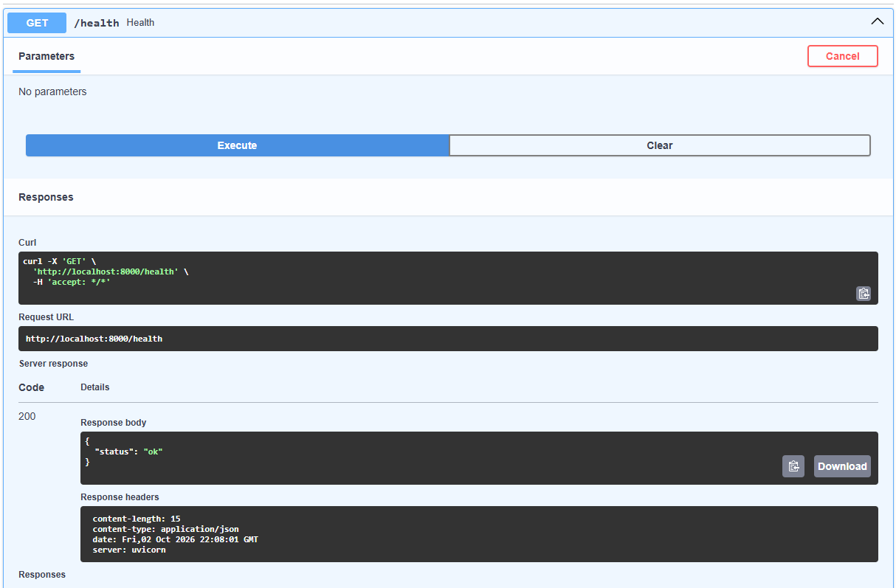
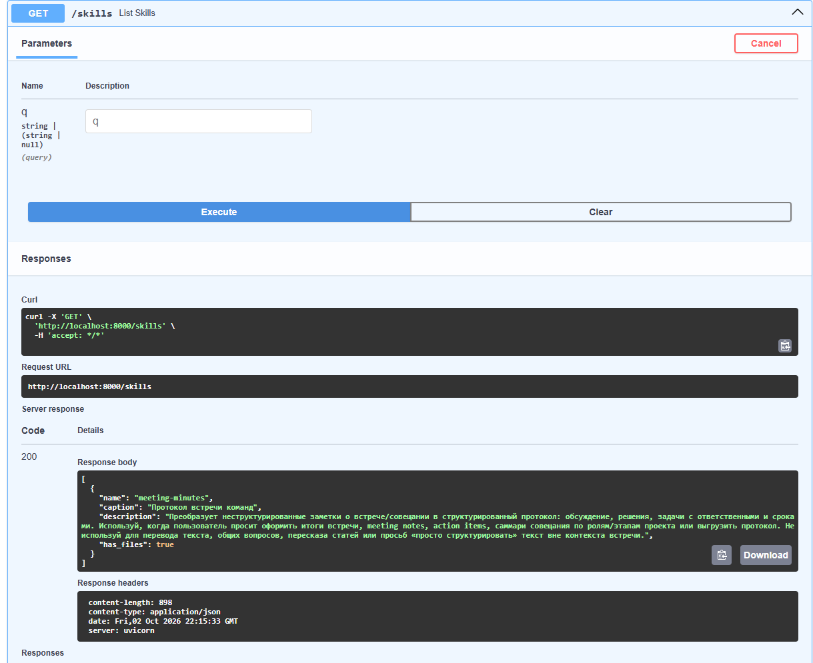
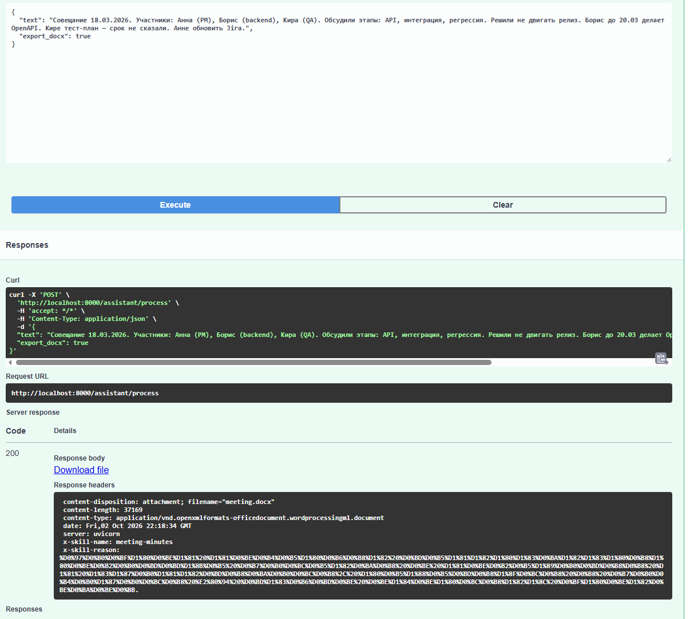
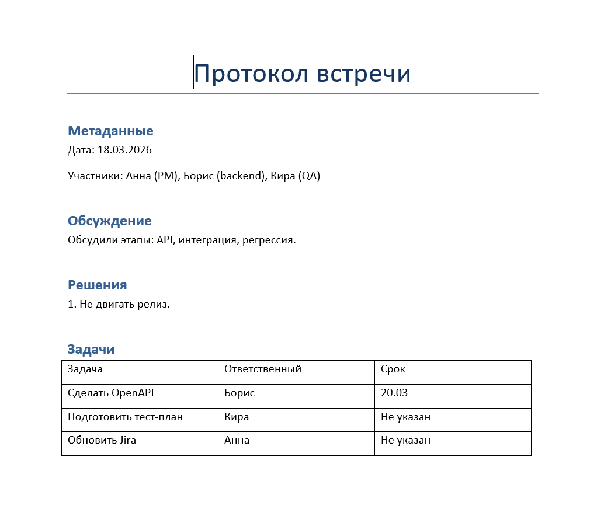
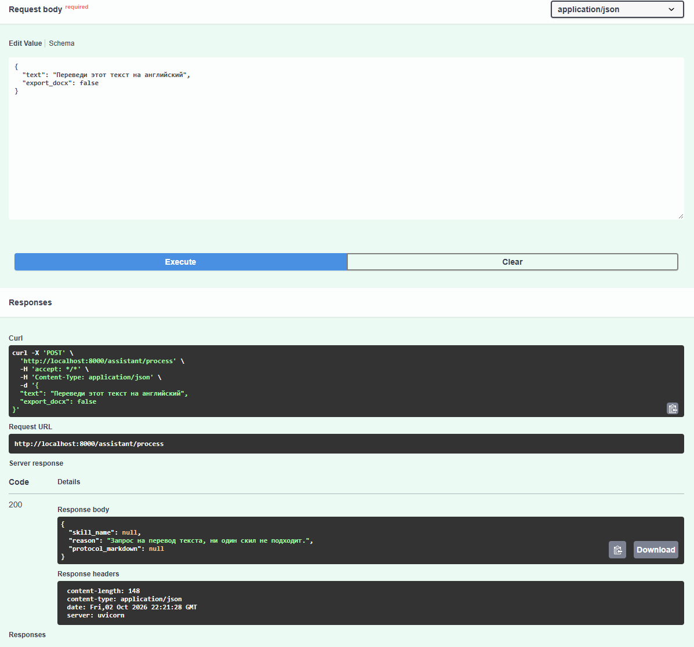
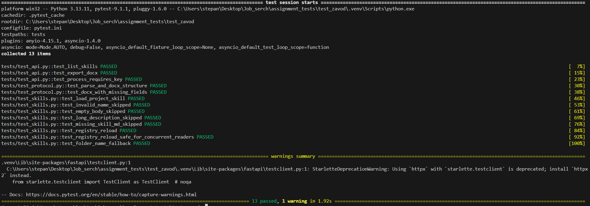
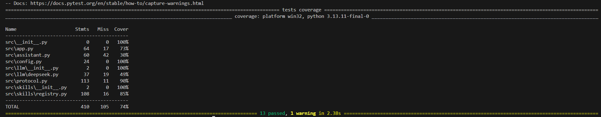

# Meeting Skills Assistant

Заметки совещания → классификация скилла (DeepSeek) → протокол → готовый `.docx`.

## Как это работает

1. На вход — **неструктурированные** заметки встречи (обычный текст / `string`).
2. DeepSeek читает только `description` скиллов и выбирает подходящий (или `none`).
3. Если скилл выбран — в system prompt подставляется тело `SKILL.md` (+ `references/`).
4. Модель пишет протокол в markdown-формате.
5. Код собирает Word и **отдаёт файл** в ответе.

Главная ручка: `POST /assistant/process` с `"export_docx": true` → скачивание `.docx`.

## Запуск

```powershell
python -m venv .venv
.venv\Scripts\activate
pip install -r requirements.txt
copy .env.example .env   # добавить DEEPSEEK_API_KEY
uvicorn src.app:app --reload --port 8000
```

Или Docker:

```powershell
docker compose up --build
```

- Swagger: http://localhost:8000/docs
- Тесты: `pytest -q`

## API

| Метод | Путь | Что делает |
|-------|------|------------|
| GET | `/health` | сервис жив |
| GET | `/skills?q=` | список скиллов (+ поиск) |
| POST | `/skills/reload` | перезагрузка реестра без пересоздания объекта |
| POST | `/assistant/process` | **основное**: заметки → `.docx` (или JSON) |
| POST | `/export/docx` | markdown-протокол → Word **без** LLM |

### Режимы `/assistant/process`

| `export_docx` | Ответ |
|---------------|--------|
| `true` (по умолчанию) | файл `meeting.docx` + заголовки `X-Skill-Name`, `X-Skill-Reason` |
| `false` | JSON: `skill_name`, `reason`, `protocol_markdown` |

## Порядок использования

1. Открыть http://localhost:8000/docs
2. `GET /health` → `{"status":"ok"}`



3. `GET /skills` → есть `meeting-minutes`



4. `POST /assistant/process` → Try it out → тело:

```json
{
  "text": "Совещание 18.03.2026. Участники: Анна (PM), Борис (backend), Кира (QA). Обсудили этапы: API, интеграция, регрессия. Решили не двигать релиз. Борис до 20.03 делает OpenAPI. Кире тест-план — срок не сказали. Анне обновить Jira.",
  "export_docx": true
}
```



5. Execute → нажать **Download file**
6. Открыть скачанный `meeting.docx` в Word

Ожидание в документе:
- разделы Метаданные / Обсуждение / Решения / Задачи;
- задачи таблицей;
- где срок не назван — `Не указан`.



В Response headers: `X-Skill-Name: meeting-minutes`.

### Негативный кейс классификатора

Тот же `POST /assistant/process`:

```json
{
  "text": "Переведи этот текст на английский",
  "export_docx": false
}
```



Ожидание: JSON с `"skill_name": null`.

### Reload реестра

1. Поправить `skills/meeting-minutes/SKILL.md` (например `caption`).
2. `POST /skills/reload`
3. `GET /skills` — изменения видны без рестарта сервиса.

Потокобезопасность: тест `test_registry_reload_safe_for_concurrent_readers`.

> На Windows Docker Desktop иногда подвисает на bind-mount `./skills`. Если `reload` «висит», а `/skills` отвечает — перезапусти Docker Desktop. Для сдачи потокобезопасность проверяй через pytest (без Docker).

### Экспорт без LLM (опционально)

`POST /export/docx` — если уже есть готовый markdown-протокол и нужно только проверить конвертер.  
Для основного сценария **не нужен** — файл уже отдаёт `/assistant/process`.

## Тесты

### Покрытие

Валидация скиллов, Word с пропусками полей, reload без пересоздания объекта, concurrent-чтение во время reload.

### Запуск

```powershell
pytest -q
```

или подробнее:

```powershell
pytest -v
```





### Описание тестов

#### `tests/test_skills.py` — скиллы и реестр

- `test_load_project_skill` — загружается `meeting-minutes`, `has_files=true`
- `test_invalid_name_skipped` — имя не kebab-case → skip + WARNING
- `test_empty_body_skipped` — пустое тело `SKILL.md` → skip + WARNING
- `test_long_description_skipped` — `description` > 1024 → skip + WARNING
- `test_missing_skill_md_skipped` — нет `SKILL.md` → skip + WARNING
- `test_folder_name_fallback` — без `name` в frontmatter берётся имя папки
- `test_registry_reload` — тот же объект после `reload()`, список обновляется, работает поиск
- `test_registry_reload_safe_for_concurrent_readers` — 4 потока читают, 1 делает `reload()`; без падений, snapshot консистентный

#### `tests/test_protocol.py` — протокол и Word

- `test_parse_and_docx_structure` — парсинг markdown; в `.docx` заголовок, секции, таблица задач
- `test_docx_with_missing_fields` — пропуски полей → плейсхолдеры `Не указан` / `Нет данных`

#### `tests/test_api.py` — HTTP без DeepSeek

- `test_list_skills` — `GET /skills` отдаёт `meeting-minutes`
- `test_export_docx` — `POST /export/docx` возвращает валидный docx (`PK…`)
- `test_process_requires_key` — без ключа `POST /assistant/process` → `503`

## Структура

```
skills/meeting-minutes/   # SKILL.md, references/, eval_queries.md
src/
  app.py                  # FastAPI + wiring
  config.py               # env / settings
  assistant.py            # classify → skill → protocol
  protocol.py             # parse + docx
  llm/
    deepseek.py           # клиент DeepSeek
  skills/
    registry.py           # загрузка + реестр
tests/
img/                      # скрины для README
```

## Важно

Без `DEEPSEEK_API_KEY` работают `/skills` и `/export/docx`; `/assistant/process` вернёт `503`.
